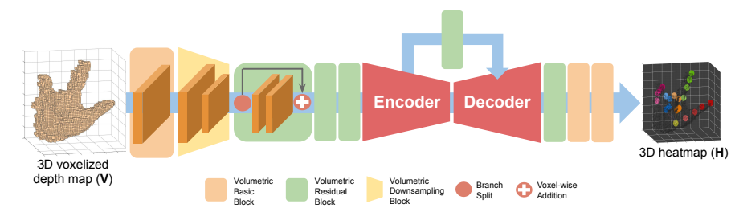
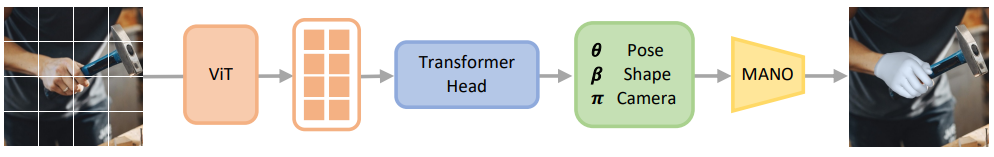
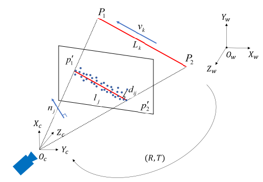

# Hand and Object Related Vision Overall Guidance

For hand and object pose estimation and perception, there are several Python packages and libraries that you can use. Here are some popular ones along with brief tutorials on how to get started.

## **1 Deep Learning-Pytorch**
There are several official guidelines and resources provided by reputable organizations and institutions that can help you understand Pytorch. Here are some recommended resources:
### **[1.1 Python Basics](<https://github.com/LukeDitria/pytorch_tutorials/tree/main/section00_python_basics>)**
### **[1.2 Machine Learning with Numpy](<https://github.com/LukeDitria/pytorch_tutorials/tree/main/section01_numpy_ml>)**
### **[1.3 Pytorch Intro and Basics](<https://github.com/LukeDitria/pytorch_tutorials/tree/main/section02_pytorch_basics>)**
### **[1.4 Multi-Layer Perceptron for Classification and Non-Linear Regression](<https://github.com/LukeDitria/pytorch_tutorials/tree/main/section03_pytorch_mlp>)**
### **[1.5 Convolutions and CNNs](<https://github.com/LukeDitria/pytorch_tutorials/tree/main/section04_pytorch_cnn>)**
### **[1.6 Pytorch Tools and Training Techniques](<https://github.com/LukeDitria/pytorch_tutorials/tree/main/section06_pretraining_augmentations>)**
### **[1.7 Bounding Box Detection and Image Segmentation](<https://github.com/LukeDitria/pytorch_tutorials/tree/main/section08_detection>)**
### **[1.8 Sequential Data](<https://github.com/LukeDitria/pytorch_tutorials/tree/main/section12_sequential>)**
### **[1.9 Attention](<https://github.com/LukeDitria/pytorch_tutorials/tree/main/section13_attention>)**
### **[1.10 Transformer](<https://github.com/LukeDitria/pytorch_tutorials/tree/main/section14_transformers>)**
### **[1.11 Deploying Models](<https://github.com/LukeDitria/pytorch_tutorials/tree/main/section15_deploying_models>)**

## Hand and Object Perception and Pose Estiamtion:Problem Modeling
Modeling hand and object perception and pose estimation is a complex task that involves several steps, including data collection, model selection, training, and evaluation. Here’s a structured approach to tackle this problem:

### 2. **Define the Problem**
   - **Hand Detection**: Identify and locate hands in images or video streams.
   - **Object Detection**: Identify and locate objects interacting in the same scene with hands.
   - **Pose Estimation**: Estimate the pose of the hand and the object, which includes the hand joint position and articulation with object rigid pose.

Hand pose estimation is similar to human pose estimation, predicting the position of the joints (usually 21 2D/3D keypoints) with a close-up image of the hands.

Fig1: Visualization of modeling hand with 14, 16 and 21 joints as used in NYU :[1](https://dl.acm.org/doi/10.1145/2629500),
ICVL :[2](https://ieeexplore.ieee.org/document/6909879), and MSRA :[3](https://ieeexplore.ieee.org/document/6909541) datasets. 

The following diagram shows a classic implementation (heatmap model):

Fig2: Architecture of V2V-PoseNet network using 3D CNN as encoder and decoder.
Originally used in [4](https://openaccess.thecvf.com/content_cvpr_2018/papers/Moon_V2V-PoseNet_Voxel-to-Voxel_Prediction_CVPR_2018_paper.pdf).

**Input** a hand image into the Encoder-Decoder structure, select the position with the largest response from the feature map output by the Decoder, and calculate the loss with the heat map of the ground truth generated by the 2D landmark, so that the feature map generated by the Decoder has corresponding responses at different positions on the hand, that is, from the point of interest (PoI) It is changed to construct a regional of interest (RoI) representation, that is, to let the network focus on a certain point to a range, so as to expand the generalization ability of the model and the estimation robustness of complex cases.

**Before** the advent of parametric model MANO/SMPL, this method was the mainstream narrative in the field of pose estimation.In recent years, CVPR, ECCV, ICCV hand pose estimation papers are focused on model-based methods, that is, schemes based on parametric models. Among them, the most mainstream parametric model is "Embodied Hands: Modeling and Capturing Hands and Bodies Together" published by Javier Romero, Dimitrios Tzionas, and Michael J. Black in Siggraph Asia in 2017:[5](https://dl.acm.org/doi/abs/10.1145/3130800.3130883).

**Based** on the "SMPL: A Skinned Multi-Person Linear Model (2015)" jointly proposed by Max Planck and Industrial Light & Magic:[6](https://dl.acm.org/doi/10.1145/2816795.2818013), this paper proposes a parametric model for the hand, the main purpose of which is to solve occlusion issues with 3D human prior. 

**MANO** models the entire hand in a segmented and rigid manner. As a 3D parametric model, its parameters have 778 vertices and 1538 faces, and according to 16 keys + 5 from vertices.The points on the fingertips form a complete chain of hands, or forward kinematic trees.With parametric models we could simplfy the design of neural networks to predict the parameters.

**Here** is one of a classific example estimating hand pose with MANO:

Fig2: Pipeline of HaMeR.
Originally used in [7](https://geopavlakos.github.io/hamer/).

**In** computer vision, the target position refers to its orientation and coordinates relative to the camera. You can change this position by changing the position of the object (relative to the camera) or by changing the position of the camera (relative to the object).

**The** pose estimation problem described in this tutorial is often referred to in computer vision terminology as the perspective N-point problem, or PNP. As we will see in more detail in the following sections, in this problem our goal is to find the pose of an object when the camera is calibrated, we know the position of n three-dimensional points on the object and the corresponding two-dimensional projection in the image.

Fig3：6-DoF pose estimating demo, originally used in [8](https://arxiv.org/pdf/2408.03225)

### 3. **Data Collection**
   - **Datasets**: Use existing datasets or create your own. Some popular datasets include:
     - **Hand and object interaction Datasets**: 
       - [InterHands2.6M](https://mks0601.github.io/InterHand2.6M/): A Dataset and Baseline for 3D Interacting Hand Pose Estimation from a Single RGB Image.
       - [DexYCB](https://dex-ycb.github.io/): A Benchmark for Capturing Hand Grasping of Objects.
       - [HO3D](https://github.com/shreyashampali/ho3d): A datasets with 3D pose annotations for hands and object under severe occlusions from each other.
       - [AssemblyHands](https://assemblyhands.github.io/):a large-scale benchmark dataset with accurate 3D hand pose annotations.

### 4. **Preprocessing**
   - **Data Augmentation**: Apply techniques such as rotation, scaling, and flipping to increase the diversity of your training data. You can use real-time enhancement while training with augmentation library:[Albumentations documentation](https://albumentations.ai/docs/)
   - **Normalization**: Normalize images to ensure consistent input to the model(image format and size etc.).

### 5. **Model Selection**
   **Models**:You can test the following models on datasets above.
   - Baseline Model for Hand Detection [Openpose](https://github.com/CMU-Perceptual-Computing-Lab/openpose)
   - Baseline Model for HOI Pose Estimation [HOPE](https://github.com/bardiadoosti/HOPE)
   - SOTA HOI Pose Estimation [HOISDF](https://github.com/amathislab/HOISDF)

### 6. **Model Training**
   - **Frameworks**: Use frameworks PyTorch to build and train your models.
   - **Loss Functions**: Choose appropriate loss functions for hand and object detection tasks (e.g., cross-entropy loss for classification, mean squared error for regression).
   - **Training Process**: Split your dataset into training, validation, and test sets. Train your model using the training set and validate it using the validation set.

### 7. **Evaluation**
   - **Metrics**: Use metrics such as Intersection over Union (IoU) for object detection, Mean Per Joint Position Error (MPJPE) to evaluate the performance of your hand pose estimation, object center error(OCE) and mean corner error(MCE) for object pose estimation.
   - **Visualization**: Visualize the results to understand how well the model is performing in terms of hand and object detection and pose estimation.[Visualizer](https://github.com/isarandi/poseviz)

## Implemention
You can follow the links to implement the project [HOPE](https://github.com/bardiadoosti/HOPE) or [HOISDF](https://github.com/amathislab/HOISDF)

## Reference
### ContactArt: Learning 3D Interaction Priors for Category-level Articulated Object and Hand Poses Estimation https://ieeexplore.ieee.org/abstract/document/10550760
### RGBManip: Monocular Image-based Robotic Manipulation through Active Object Pose Estimation https://ieeexplore.ieee.org/abstract/document/10610690
### EvHandPose: Event-Based 3D Hand Pose Estimation With Sparse Supervision https://ieeexplore.ieee.org/abstract/document/10478195
